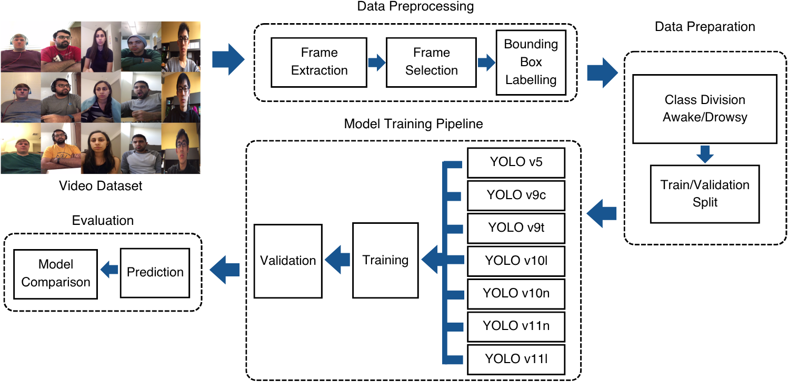

# 🛑 Real-Time Driver Drowsiness Detection using YOLO Variants & Eye Aspect Ratio

Driver drowsiness remains a critical factor in road accidents, accounting for thousands of fatalities and injuries each year. This project presents a comprehensive evaluation of real-time, non-intrusive drowsiness detection methods using computer vision techniques, specifically leveraging YOLO (You Only Look Once) object detection architectures.

## 🧠 Project Overview

We explored both deep learning-based and classical approaches for detecting drowsy behavior:
- **YOLO-based eye state classification** using fine-tuned models across seven variants (v5s, v9c, v9t, v10n, v10l, v11n, v11l)
- **Eye Aspect Ratio (EAR)**-based method using Dlib's facial landmarks

Each method was tested on a publicly available, labeled dataset featuring diverse lighting, eyewear, gender, and ethnicity conditions.

---

The complete system architecture of the Drowsiness Detection System 

## 📂 Dataset

We used the **UTARLDD dataset** for training and evaluation:  
🔗 [UTARLDD Dataset](https://sites.google.com/view/utarldd/home?authuser=0)

- Classes: `awake`, `drowsy`
- Collected in diverse real-world driving scenarios
- Includes variability in illumination, skin tone, gender, and eyewear

---

## 📊 Performance Evaluation

| YOLO Variant | Precision | Recall | mAP@0.5 | mAP@0.5–0.95 |
|--------------|-----------|--------|---------|--------------|
| YOLOv5s      | 0.925     | 0.930  | 0.951   | 0.781        |
| YOLOv9c      | **0.962** | **0.978**  | **0.986**   | **0.829**        |
| YOLOv9t      | 0.948     | 0.970  | 0.978   | 0.812        |
| YOLOv10n     | 0.942     | 0.968  | 0.975   | 0.804        |
| YOLOv10l     | 0.957     | 0.974  | 0.983   | 0.823        |
| YOLOv11n     | 0.954     | 0.958  | 0.976   | 0.817        |
| YOLOv11l     | 0.960     | 0.965  | 0.979   | 0.821        |

> ✅ **Best Accuracy:** YOLOv9c  
> ⚖️ **Best Efficiency Trade-off:** YOLOv11n (ideal for embedded deployment)

---

## 👁️ EAR-Based Drowsiness Detection

- Based on **Eye Aspect Ratio (EAR)** thresholding
- Lightweight and fast using **Dlib** facial landmarks
- Works well under ideal conditions but suffers from:
  - Sensitivity to **head pose**
  - Poor robustness with **eyewear** or **occlusions**

---

## 📌 Conclusion

This project highlights the trade-offs between accuracy, speed, and resource requirements across multiple YOLO variants. While YOLOv9c offers the best raw accuracy, YOLOv11n is a top choice for real-time applications on edge devices. EAR-based methods, though efficient, should be used cautiously due to their limitations in real-world settings.

These insights are applicable in:
- **Autonomous Driving Systems**
- **Driver Monitoring Solutions**
- **Industrial Safety Monitoring**

---

## 🔧 Technologies Used

- Python
- YOLOv5–YOLOv11 (Ultralytics & official variants)
- OpenCV
- Dlib & imutils
- PyTorch

---

*Created with ❤️ by Dilshara Herath*
